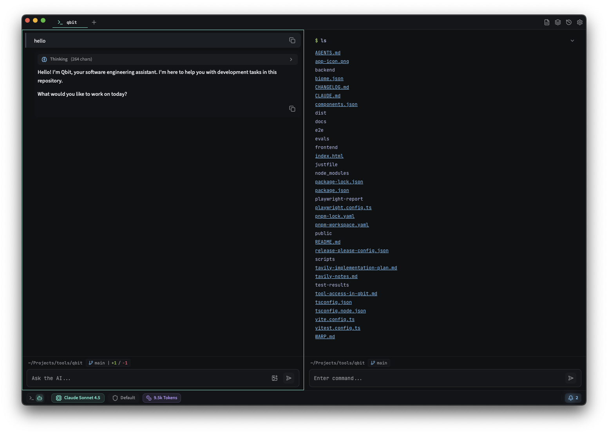

<div align="center">


# Qbit

**An AI-powered terminal that shows its work.**

[](#installation)
[](https://www.rust-lang.org/)
[](https://tauri.app/)
[](LICENSE)

[Features](#features) • [Installation](#installation) • [Configuration](#configuration) • [Development](#development) • [Architecture](#architecture)

<br>



</div>

---

## Why Qbit?

Developers don't trust magic. We trust logs, stack traces, and reproducible steps. Qbit applies the same principle to AI: every tool call, every file read, every reasoning step is visible and inspectable.

Watch agents hand off tasks, review the commands they plan to run, trace exactly what context was used. When AI-generated code breaks, you know where to look.

---

## Features

### Specialized Sub-Agents

Different tasks need different expertise. Qbit routes work to the right specialist:

| Agent | Purpose | Tools |
|-------|---------|-------|
| **Coder** | Applies surgical code edits using unified diffs. Outputs git-style diffs that are parsed and applied automatically. | `read_file`, `list_files`, `grep_file`, `ast_grep`, `ast_grep_replace` |
| **Analyzer** | Deep semantic analysis: traces data flow, identifies dependencies, explains complex logic. | `read_file`, `grep_file`, `ast_grep`, `list_directory`, `find_files`, indexer tools |
| **Explorer** | Maps codebase structure, traces dependencies, identifies relevant files for implementation planning. | `read_file`, `list_files`, `list_directory`, `grep_file`, `ast_grep`, `find_files`, `run_pty_cmd` |
| **Researcher** | Researches topics via web search and documentation lookup. Use for understanding APIs, libraries, or external info. | `web_search`, `web_fetch`, `read_file` |
| **Executor** | Executes shell commands and manages system operations. Handles multi-step builds and command sequences. | `run_pty_cmd`, `read_file`, `list_directory` |

Each agent sees only the tools relevant to its job. No sprawl. No permission overreach.

### Multi-Provider LLM Support

| Provider | Configuration |
|----------|---------------|
| Anthropic (Vertex AI) | `gcloud auth` or service account JSON |
| Anthropic (Direct API) | `ANTHROPIC_API_KEY` |
| OpenAI | `OPENAI_API_KEY` |
| OpenRouter | `OPENROUTER_API_KEY` |
| Google Gemini | `GEMINI_API_KEY` |
| Groq | `GROQ_API_KEY` |
| xAI (Grok) | `XAI_API_KEY` |
| Z.AI (GLM) | `ZAI_API_KEY` |
| Ollama | Local server (no API key needed) |

Switch providers mid-session. Use local models for sensitive codebases.

### AI Tools

- **File Operations**: `read_file`, `edit_file`, `write_file`, `create_file`, `delete_file`
- **Code Search**: `grep_file`, `list_files`, `ast_grep`, `ast_grep_replace`
- **Indexer Tools**: Semantic analysis via tree-sitter (symbols, metrics, dependencies)
- **Shell Execution**: `run_command` with full PTY support
- **Web Access**: `web_search`, `web_fetch` (via Tavily or native Claude tools on Vertex AI)
- **Planning**: `update_plan` for task tracking

### Terminal & UI

- **Clean Interface**: Minimal, distraction-free design with multiple theme support
- **Command Blocks**: Output organized into collapsible blocks with exit codes
- **Split Panes**: Multi-pane layouts for side-by-side terminals
- **Multi-Tab Sessions**: Independent PTY per tab
- **Shell Integration**: Command detection via OSC 133 sequences
- **Fullterm Mode**: Auto-switches to raw xterm.js for TUI apps (vim, htop, ssh)

### Agent Skills

Extend Qbit with custom skills following the [agentskills.io](https://agentskills.io) specification:

- **Slash Commands**: Type `/` to access prompts and skills
- **Local + Global**: Project-specific skills override global ones
- **Structured Format**: YAML frontmatter with markdown instructions
- **Tool Restrictions**: Optionally limit which tools a skill can use

```bash
# Create a skill
mkdir -p ~/.qbit/skills/code-review
cat > ~/.qbit/skills/code-review/SKILL.md << 'EOF'
---
name: code-review
description: Review code for quality and best practices
allowed-tools: read_file grep_file ast_grep
---

You are a code review expert. Analyze the provided code for...
EOF
```

### Safety & Control

- **Human-in-the-Loop**: Approval gates for shell commands and file writes
- **Pattern Learning**: Build trust over time with learned approval preferences
- **Loop Detection**: Protection against agent infinite loops
- **Context Compaction**: Automatic pruning when approaching token limits
- **Session Persistence**: Conversations saved and resumable

---

## Installation

### Download (macOS)

1. Download the latest `.dmg` from [Releases](https://github.com/qbit-ai/qbit/releases)
2. Open the `.dmg` and drag **Qbit** to Applications
3. On first launch: **System Settings → Privacy & Security → Open Anyway**

Builds available for Apple Silicon (ARM64) and Intel (x86_64).

### Build from Source

**Requirements**: macOS, Node.js 20+, pnpm, Rust (stable), [just](https://github.com/casey/just)

```bash
git clone https://github.com/qbit-ai/qbit.git
cd qbit
just install
just dev
```

---

## Configuration

Settings are stored in `~/.qbit/settings.toml` (auto-generated on first run).

### Quick Setup

**Option A: Vertex AI (Anthropic Claude)**
```bash
# Set in settings.toml or as environment variables
GOOGLE_APPLICATION_CREDENTIALS=/path/to/service-account.json
VERTEX_AI_PROJECT_ID=your-project-id
```

**Option B: Anthropic Direct**
```bash
echo "ANTHROPIC_API_KEY=sk-ant-..." >> .env
```

**Option C: OpenAI**
```bash
echo "OPENAI_API_KEY=sk-..." >> .env
```

**Option D: Ollama (Local)**
```bash
# Just have Ollama running - no API key needed
```

### Web Search

Enable Tavily-powered web search:
```bash
echo "TAVILY_API_KEY=tvly-..." >> .env
```

Most settings can be configured through the in-app Settings UI.

---

## Development

### Commands

```bash
just dev              # Full app with hot reload
just dev-fe           # Frontend only (Vite on port 1420)
just check            # All checks (biome + clippy + fmt)
just test             # All tests (frontend + Rust)
just test-e2e         # E2E tests (Playwright)
just build            # Production build
just eval             # Run evaluation scenarios
```

Run `just --list` for all available commands.

### Frontend-Only Development

The frontend runs standalone with full mock support:

```bash
just dev-fe
```

This spins up Vite with a mock Tauri environment. Useful for rapid UI iteration without LLM costs.

### Adding a New Tool

1. Define schema in `backend/crates/qbit-ai/src/tool_definitions.rs`
2. Implement executor in `backend/crates/qbit-ai/src/tool_executors.rs`
3. Register in the tool registry
4. Add event handler in `frontend/hooks/useAiEvents.ts`

---

### Vertex AI Setup

**Option A: Application Default Credentials (recommended for development)**

```bash
gcloud auth application-default login
```

Then add to `~/.qbit/settings.toml`:
```toml
[ai]
default_provider = "vertex_ai"

[ai.vertex_ai]
project_id = "your-project-id"
location = "us-east5"
```

**Option B: Service Account (recommended for production)**

```toml
[ai.vertex_ai]
credentials_path = "/path/to/service-account.json"
project_id = "your-project-id"
location = "us-east5"
```

## Architecture

```
qbit/
├── frontend/               # React 19 + TypeScript + Vite 7
│   ├── components/         # UI components (shadcn/ui + custom)
│   ├── hooks/              # Tauri event subscriptions
│   ├── lib/                # Typed invoke() wrappers
│   └── store/              # Zustand + Immer state
└── backend/crates/         # Rust workspace (29 crates)
    ├── qbit/               # Main app: Tauri commands, CLI
    ├── qbit-ai/            # Agent orchestration, LLM clients
    ├── qbit-core/          # Foundation types (zero deps)
    ├── qbit-sub-agents/    # Sub-agent definitions
    ├── qbit-tools/         # Tool system and registry
    ├── qbit-pty/           # PTY/terminal management
    ├── qbit-context/       # Token budget, pruning
    ├── qbit-hitl/          # Human-in-the-loop approval
    ├── qbit-workflow/      # Multi-step task pipelines
    └── ...                 # 20 more infrastructure crates
```

### Tech Stack

| Layer | Technology |
|-------|------------|
| Framework | Tauri 2 |
| Frontend | React 19, TypeScript, Vite 7, Tailwind v4 |
| State | Zustand 5 + Immer |
| Terminal | xterm.js, portable-pty, vte |
| UI | shadcn/ui, Radix primitives |
| AI | rig-core, vtcode-core |
| Workflows | graph-flow |

### Crate Layers

The 29 Rust crates follow strict architectural layers:

1. **Foundation** (`qbit-core`): Types, traits, errors. Zero internal dependencies.
2. **Infrastructure** (25 crates): Reusable services. Depend only on foundation.
3. **Domain** (`qbit-ai`): Agent orchestration. Depends on infrastructure.
4. **Application** (`qbit`): Entry points. Tauri commands and CLI.

---

## Contributing

Read `AGENTS.md` for agent system internals.

**Commit Format**: Conventional Commits required.

```
feat(ai): add context window management
fix(terminal): prevent resize flicker
docs: clarify approval system behavior
```

CI runs checks, tests, and AI evals on every PR.

---

## License

MIT
