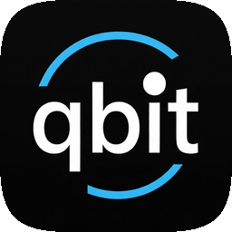
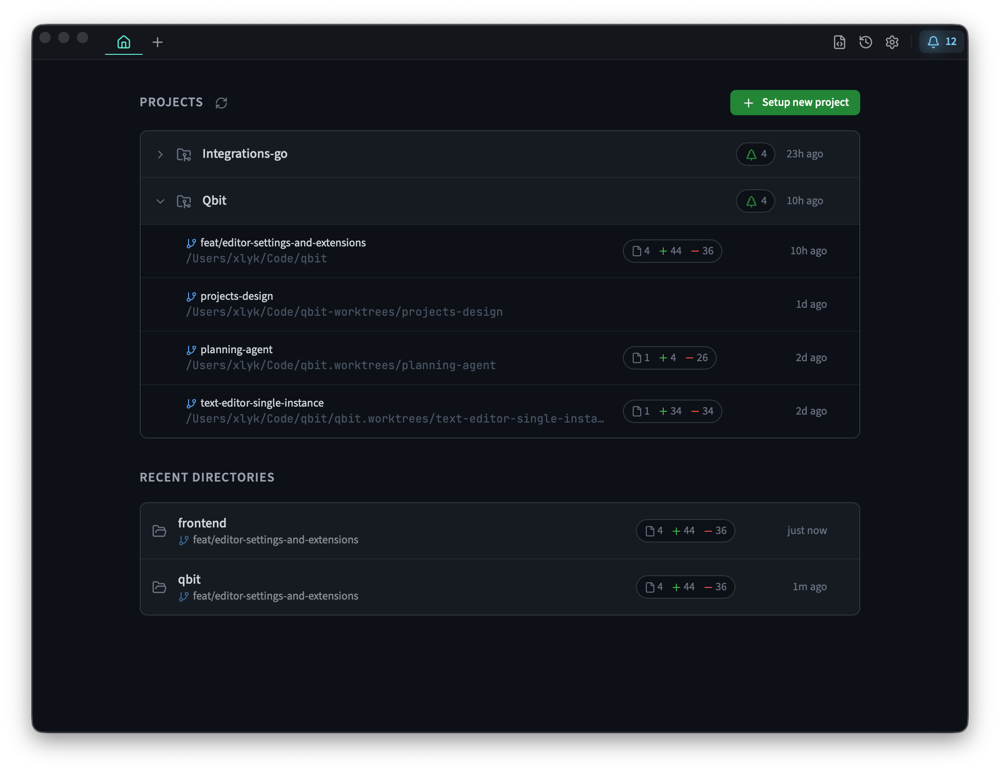
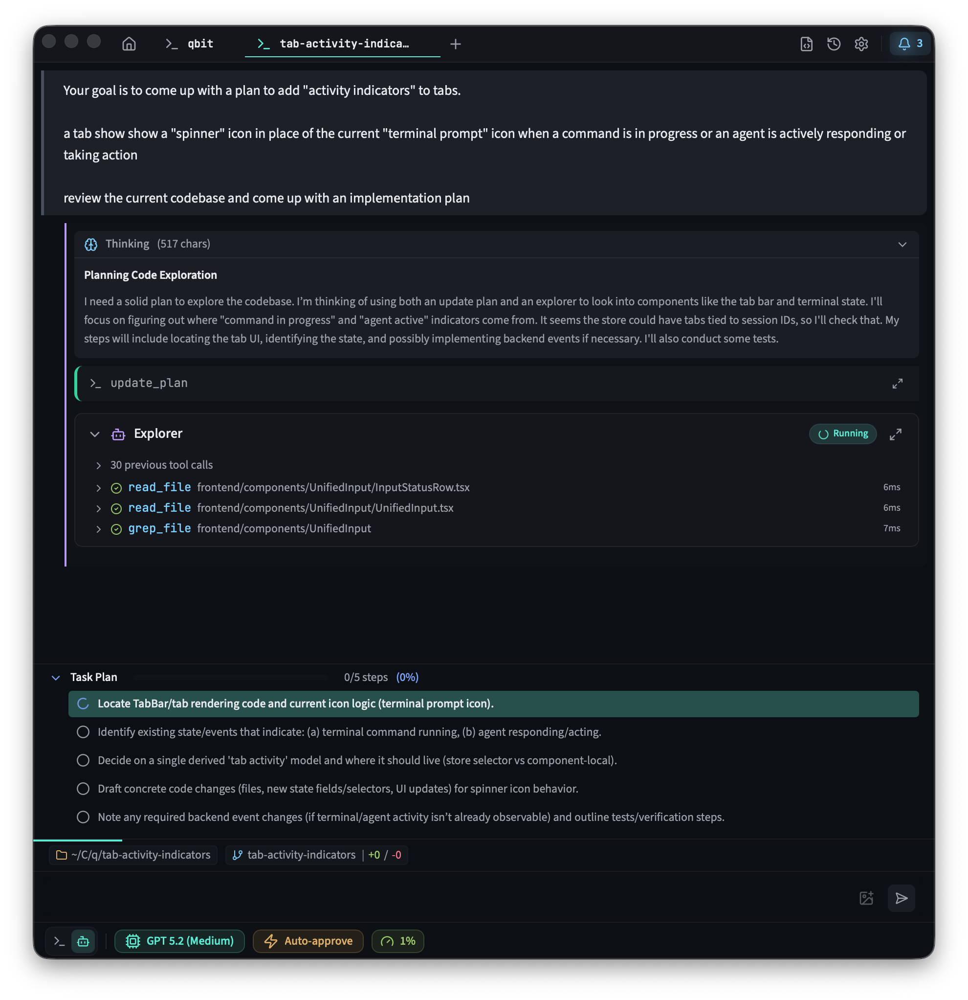
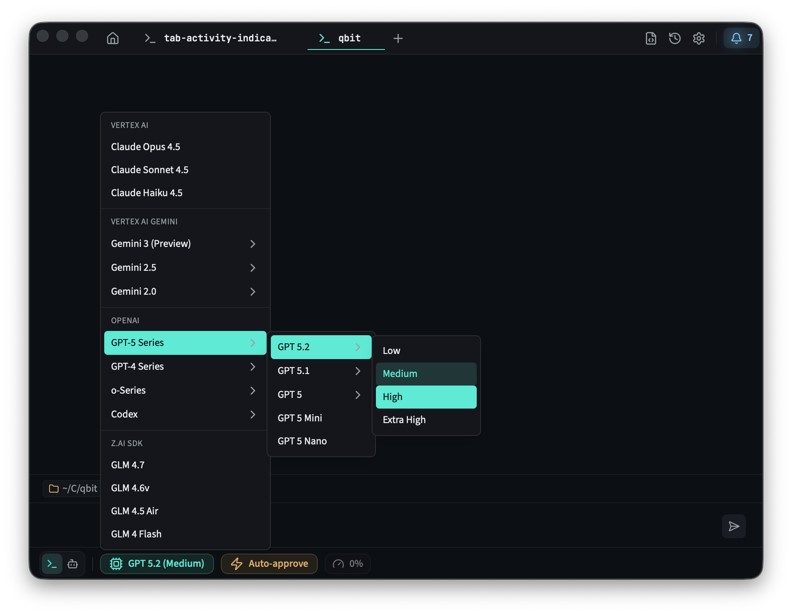
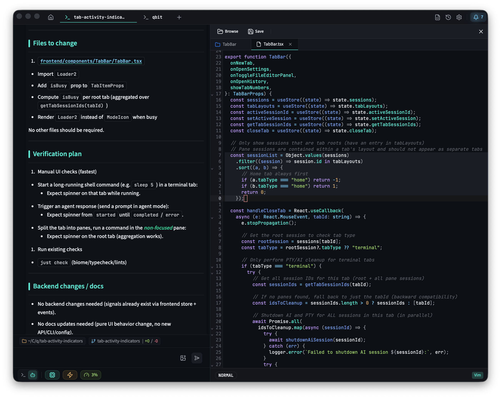
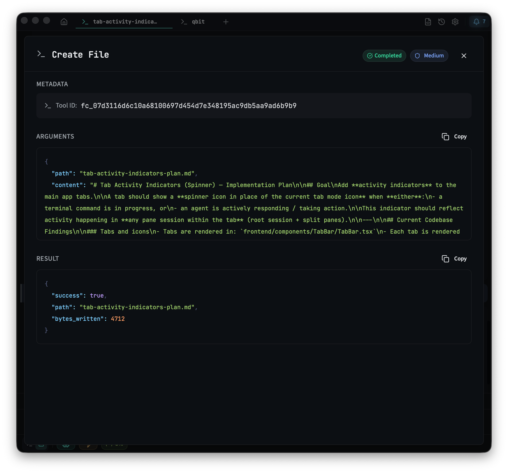
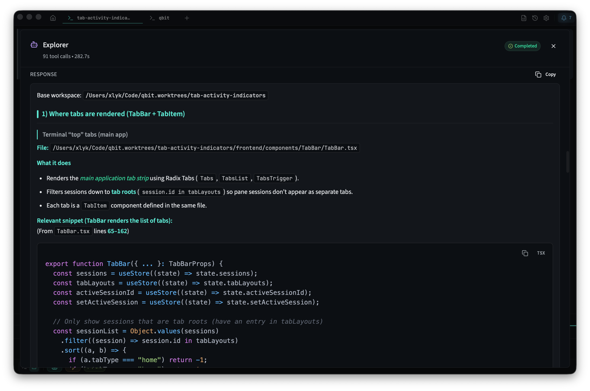
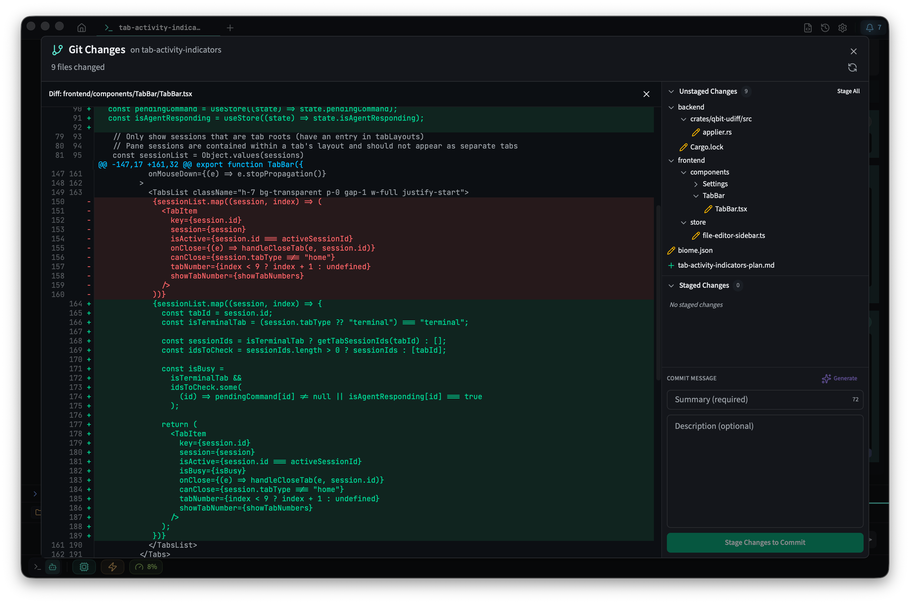

<div align="center">



# Qbit
## Open Source Agentic Terminal Application


[](#quickstart)
[](https://www.rust-lang.org/)
[](https://tauri.app/)
[](LICENSE)

[](https://github.com/qbit-ai/qbit/pulls)

[Quickstart](#quickstart) • [Docs](docs/README.md) • [Development](docs/development.md)

</div>

---

## About Qbit

- Free and open-source.
- No account or subscription required. Bring your own keys.
- Fully transparent. No mysteries, no bullshit.
- Empowers users with information and full control.

---

## Features

<div align="center">

### Project Management
Organize workspaces with project shortcuts and quick access

[](docs/img/home.png)

### Unified Timeline
Seamless conversation with AI, tool results, and terminal output

[](docs/img/timeline.png)

### Model Selection
Choose from multiple AI providers and models

[](docs/img/model-selection.png)

### Inline Text Editing
Review and edit AI-generated content before applying

[](docs/img/text-editor.png)

### Tool Transparency
Full visibility into every tool call and its execution

[](docs/img/tool-details.png)

### Sub-agent Execution
Detailed view of sub-agent tasks and their results

[](docs/img/sub-agent-details.png)

### Git Integration
Built-in version control with diff visualization

[](docs/img/git-integration.png)

</div>

---

## Quickstart

### Install (macOS)

```bash
brew tap qbit-ai/tap
brew install --cask qbit
```

### Run from source

```bash
git clone https://github.com/qbit-ai/qbit.git
cd qbit
just install
just dev
```

---

## Linux Installation

### Install from release build

Download and extract the release build:

```bash
curl -L -o qbit_x64.app.tar.gz \
  https://github.com/qbit-ai/qbit/releases/download/v0.2.13/qbit_x64.app.tar.gz

mkdir -p qbit-release

tar -xzf qbit_x64.app.tar.gz -C qbit-release
```

Add the binary to your `PATH` (adjust as needed for your system):

```bash
sudo install -m 755 qbit-release/qbit /usr/local/bin/qbit
```

For source builds and Linux prerequisites, see [Getting started](docs/getting-started.md).

---

## Documentation

Start here:
- [Docs index](docs/README.md)
- [Getting started](docs/getting-started.md)
- [Configuration](docs/configuration.md)
- [Providers](docs/providers.md)

Using Qbit:
- [Workspaces](docs/workspaces.md)
- [Agent modes](docs/agent-modes.md)
- [Agent skills](docs/agent-skills.md)
- [Tool use](docs/tool-use.md)
- [MCP integration](docs/mcp.md)

Developing:
- [Development](docs/development.md)
- [Architecture](docs/architecture.md)

Evaluation / benchmarks:
- [Rig evals](docs/rig-evals.md)
- [SWE-bench](docs/swebench.md)
